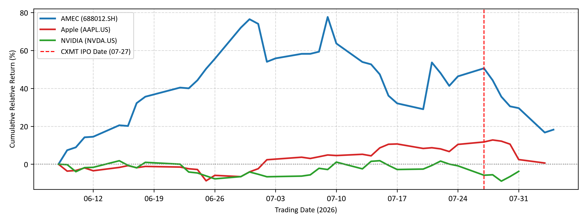
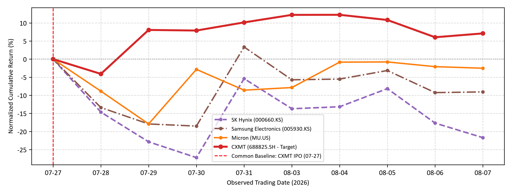
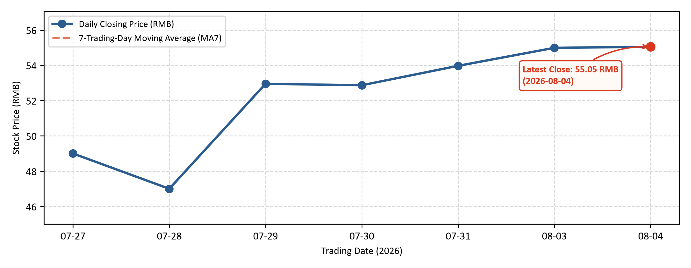

# CXMT Semiconductor Analysis / CXMT 半导体分析

> Independent quantitative research note / 独立量化研究说明  
> Event-aligned normalized return analysis / 事件对齐标准化收益分析

This repository contains the frozen research materials for **CXMT IPO and Semiconductor Ecosystem Response: An Event-Aligned Normalized Return Analysis**.

本仓库保存《CXMT IPO and Semiconductor Ecosystem Response: An Event-Aligned Normalized Return Analysis》的最终冻结研究材料。

**Author / 作者:** Liu Ruize  
**Public research version / 公开研报版本:** Final V4  
**Publication date / 发布日期:** 2026-08-08  
**Event date / 事件日:** 2026-07-27  
**Frozen research window / 冻结研究窗口:** 2026-06-08 to 2026-08-07  
**Zenodo DOI / DOI:** [10.5281/zenodo.21847934](https://doi.org/10.5281/zenodo.21847934)  
**Archive status / 归档状态:** DOI reserved; Zenodo publication pending / DOI 已预留；等待 Zenodo 正式发布

## Research Note / 研报

- [Final V4 PDF](report/CXMT_IPO_Research_Note_Final_V4_2026-08-08.pdf)
- [Final V4 DOCX](report/CXMT_IPO_Research_Note_Final_V4_2026-08-08.docx)

The PDF is the public reading version. The DOCX is retained as the editable source document for transparency and preservation.

PDF 为公开阅读版本；DOCX 作为可编辑源文件保留，用于透明度与长期保存。

## Research Scope / 研究范围

The study asks three descriptive questions:

1. How did selected semiconductor-ecosystem companies perform during the observation window surrounding the CXMT IPO?
2. How did CXMT and selected global memory peers differ after alignment to the common July 27 event-date baseline?
3. How did CXMT's own closing price develop after listing, and what limited descriptive information is provided by MA7?

本研究围绕三个描述性问题展开：半导体生态企业在事件窗口内的表现差异、CXMT 与全球存储同行在统一事件日基准后的短期分化，以及 CXMT 上市后收盘价与 MA7 的变化。

| Company / 公司 | Ticker / 代码 | Analytical role / 分析角色 | Figure / 图表 |
|---|---|---|---|
| CXMT / 长鑫科技 | 688825.SH | Focal IPO company; memory semiconductor / 核心 IPO 标的；存储半导体 | 2, 3 |
| AMEC / 中微公司 | 688012.SH | Upstream semiconductor equipment / 上游半导体设备 | 1 |
| Micron Technology / 美光科技 | MU | Global memory peer / 全球存储同行 | 2 |
| Samsung Electronics / 三星电子 | 005930.KS | Global memory peer / 全球存储同行 | 2 |
| SK hynix | 000660.KS | Global memory peer / 全球存储同行 | 2 |
| NVIDIA / 英伟达 | NVDA | Semiconductor design and AI ecosystem / 半导体设计与 AI 生态 | 1 |
| Apple / 苹果 | AAPL | Downstream electronics demand / 下游电子需求 | 1 |

The sample is intentionally small and heterogeneous. Companies are organized by analytical role and are not all treated as semiconductor manufacturers.

样本规模较小且具有异质性。公司按分析角色分类，不应全部视为半导体制造商。

## Frozen Results / 冻结结果

All values below use daily closing prices and are frozen through **2026-08-07**.

以下结果均使用每日收盘价，数据冻结至 **2026-08-07**。

| Comparison | Frozen endpoint result |
|---|---|
| Figure 1 | AMEC **+38.49%**; NVIDIA **+7.34%**; Apple **+3.91%** |
| Figure 2 | CXMT **+7.10%**; Micron **-2.51%**; Samsung Electronics **-9.06%**; SK hynix **-21.70%** |
| Figure 3 | CXMT: RMB **49.00** on July 27 to RMB **52.48** on August 7; latest complete MA7: RMB **53.65** |

These values document short-term differentiation. They do not establish abnormal returns, causality, a sustained trend, or a trading signal.

这些数值记录了短期表现分化，但不能证明异常收益、因果关系、持续趋势或交易信号。

## Methodology / 研究方法

### Normalized Cumulative Return (NCR) / 标准化累计收益

```text
NCR(i,t) = [P(i,t) / P(i,0) - 1] x 100%
```

NCR compares each security with a specified baseline. It is a descriptive normalized-price measure, not abnormal return (AR) or cumulative abnormal return (CAR).

NCR 用于比较股票相对指定基准的价格变化。它是描述性标准化指标，不等同于异常收益（AR）或累计异常收益（CAR）。

- **Figure 1:** each security's first valid close on or after 2026-06-08.
- **Figure 2:** the exact 2026-07-27 close for all four memory-sector securities.
- **Figure 3:** CXMT closing price in RMB and a seven-trading-observation moving average; no NCR.

### Seven-Trading-Day Moving Average (MA7) / 7 个交易日移动平均线

```text
MA7(t) = [P(t) + P(t-1) + ... + P(t-6)] / 7
```

Locked implementation / 锁定实现：

```python
rolling(window=7, min_periods=7)
```

MA7 is used only for descriptive smoothing and is not a forecasting model.

MA7 仅用于描述性平滑，不是预测模型。

## Final Figures / 最终图表

### Figure 1 / 图 1



### Figure 2 / 图 2



### Figure 3 / 图 3



## Market Data Sources / 市场数据来源

| Market / 市场 | Primary source / 主要来源 | Fallback / 备用来源 |
|---|---|---|
| China A-share / 中国 A 股 | Tencent Finance / 腾讯财经 | Previously retrieved real CSV observations / 已获取的真实 CSV 数据 |
| United States / 美国 | Sina Finance / 新浪财经 | Yahoo Finance, then previously retrieved real CSV observations |
| South Korea / 韩国 | Naver Stock | Previously retrieved real CSV observations / 已获取的真实 CSV 数据 |

The repository contains seven frozen CSV files. Source mapping and data-handling rules are documented in [`references/data_sources.md`](references/data_sources.md).

仓库包含 7 份冻结 CSV。数据来源映射与处理规则见 [`references/data_sources.md`](references/data_sources.md)。

## Data Integrity Rules / 数据完整性规则

- use actual observed market data only / 仅使用真实观测数据
- do not generate future or artificial prices / 不生成未来或虚假价格
- do not forward-fill, backward-fill, or interpolate prices / 不进行前向填充、后向填充或插值
- do not manually insert unavailable prices / 不人工补入无法取得的价格
- preserve exchange-specific trading dates / 保留各交易所真实交易日
- use daily closing prices unless another source is explicitly documented / 除非另有说明，否则使用每日收盘价
- use cached CSV files only for previously retrieved real observations / CSV 缓存仅保存已真实取得的观测值

## Repository Structure / 仓库结构

```text
CXMT-Semiconductor-Analysis/
├── data/
│   ├── AMEC_688012_SH.csv
│   ├── APPLE_AAPL_US.csv
│   ├── CXMT_688825_SH.csv
│   ├── MICRON_MU_US.csv
│   ├── NVIDIA_NVDA_US.csv
│   ├── SAMSUNG_005930_KS.csv
│   └── SK_HYNIX_000660_KS.csv
├── src/
│   └── generate_report_charts.py
├── output/
│   └── charts/
│       ├── upstream_downstream_chain.png
│       ├── memory_sector_comparison.png
│       └── cxmt_price_trend.png
├── methodology/
│   ├── research_methodology.md
│   ├── mathematical_models.md
│   └── variables_definition.md
├── references/
│   ├── academic_references.md
│   ├── data_sources.md
│   └── industry_reports.md
├── report/
│   ├── CXMT_IPO_Research_Note_Final_V4_2026-08-08.pdf
│   └── CXMT_IPO_Research_Note_Final_V4_2026-08-08.docx
├── .gitignore
├── LICENSE
├── README.md
└── requirements.txt
```

Only the current frozen research version appears in the `main` branch structure. The earlier `r0` test release may remain available in GitHub Releases and Git history as a development record, but its temporary report, test charts, and test package are not part of the current replication package or Zenodo deposit.

`main` 分支结构只保留当前冻结研究版本。此前的 `r0` 测试发布可以继续保留在 GitHub Releases 和 Git 历史中，作为开发过程记录；但其临时研报、测试图表和测试包不属于当前复现包，也不进入 Zenodo。

## Reproducibility / 可复现性

Install dependencies / 安装依赖：

```bash
pip install -r requirements.txt
```

Run from the repository root / 在仓库根目录运行：

```bash
python src/generate_report_charts.py
```

The script retrieves available market data when the documented interfaces are accessible and otherwise uses eligible cached observations. It then validates the data, applies the locked baselines, calculates NCR and MA7, writes CSV files to `data/`, and exports the three figures to `output/charts/`. The research end date remains capped at 2026-08-07.

脚本在数据接口可用时获取市场数据，在接口不可用时调用符合条件的真实缓存数据；随后验证数据、应用锁定基准、计算 NCR 与 MA7，并输出 CSV 和三张图。研究终止日期始终锁定为 2026-08-07。

## Release and Archive Status / 发布与归档状态

- `r0`: historical test/pre-release; retained only for provenance / 历史测试版本，仅作为过程记录保留
- Final V4: current public research document and frozen replication materials / 当前公开研报与冻结复现材料
- `v4.0.1`: metadata-only patch adding the reserved Zenodo DOI; research data, methods, figures, findings, and AI disclosure are unchanged / 仅回填已预留 Zenodo DOI 的元数据补丁；研究数据、方法、图表、结论和 AI 披露均未改变
- Zenodo: DOI `10.5281/zenodo.21847934` reserved; publication pending / DOI `10.5281/zenodo.21847934` 已预留；等待正式发布

The final Zenodo package should contain only the Final V4 report and the matching frozen replication materials. It should not include `r0` artifacts, temporary reports, draft figures, or superseded document versions.

最终 Zenodo 包只应包含 Final V4 研报及与其一致的冻结复现材料，不包含 `r0` 文件、临时研报、草稿图或已被取代的旧版本。

## Research Limitations / 研究局限

This project is descriptive. It does not estimate expected returns, a market model, AR, CAR, or statistical event-study significance. It does not establish that the CXMT IPO caused observed price movements, infer institutional trading, or provide investment advice.

本项目属于描述性研究，不估计预期收益、市场模型、AR、CAR 或事件研究统计显著性；也不证明 CXMT IPO 导致相关价格变化，不推断机构交易，不提供投资建议。

## Documentation / 说明文档

- [`methodology/research_methodology.md`](methodology/research_methodology.md)
- [`methodology/mathematical_models.md`](methodology/mathematical_models.md)
- [`methodology/variables_definition.md`](methodology/variables_definition.md)
- [`references/data_sources.md`](references/data_sources.md)
- [`references/industry_reports.md`](references/industry_reports.md)
- [`references/academic_references.md`](references/academic_references.md)

## Citation / 引用

Recommended citation after the Zenodo record is published:

Liu, R. (2026). *CXMT IPO and Semiconductor Ecosystem Response: An Event-Aligned Normalized Return Analysis* (Version 4.0.1) [Technical note]. Zenodo. https://doi.org/10.5281/zenodo.21847934

Zenodo 记录正式发布后，建议使用上述格式引用；在正式发布前，该 DOI 仍处于预留状态。

## License / 许可证

See [`LICENSE`](LICENSE) for the repository license and reuse terms.

仓库许可与复用条款见 [`LICENSE`](LICENSE)。
